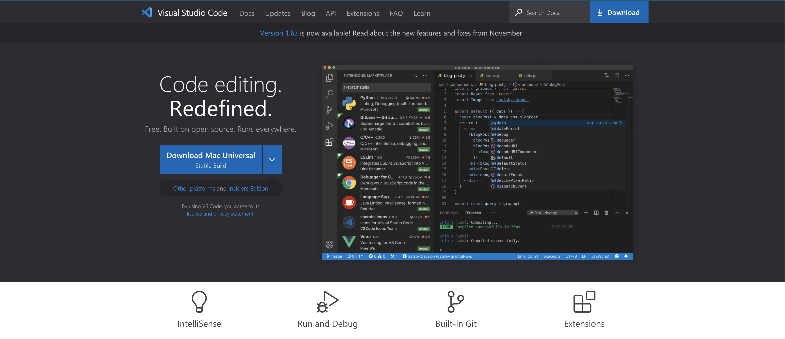
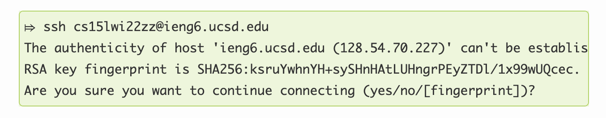
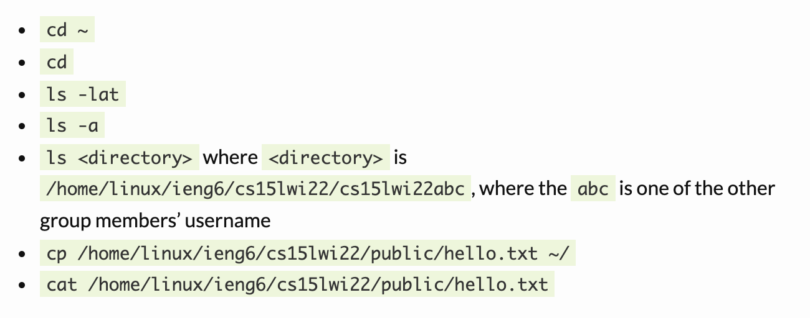
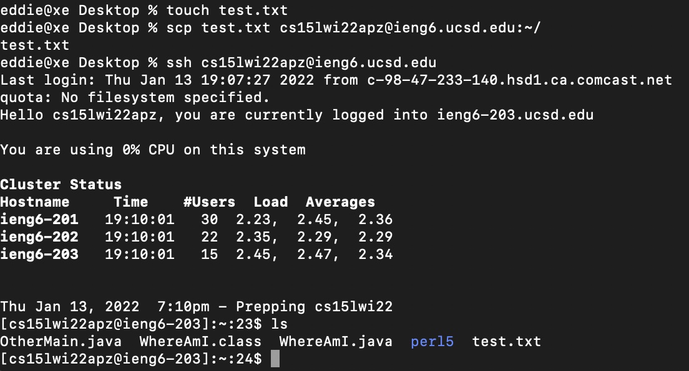
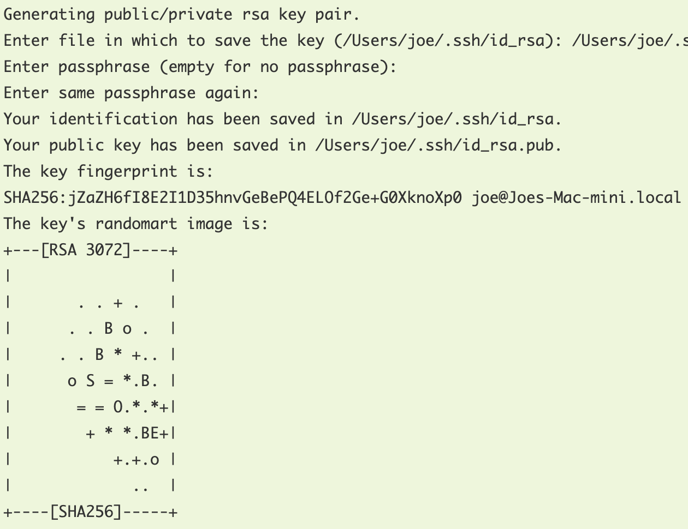
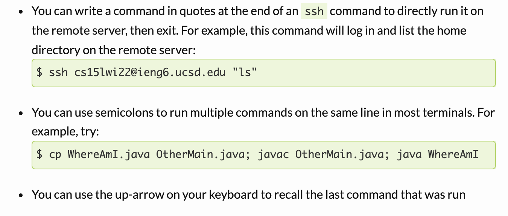
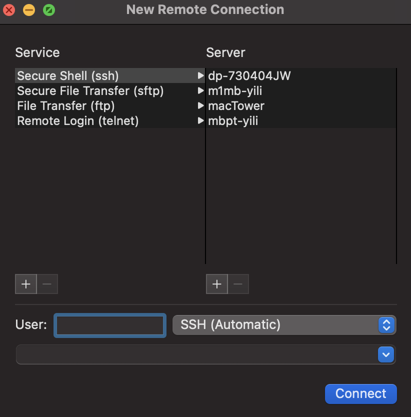

## Lab Report 1 Week 2
---
**Installing VS Code**

I already had VS Code installed prior to this lab. But if you didn't have VS code installed already, simply Google VS Code and click the download button for the OS that you have.



**Remotely Connecting**

- Install Open SSH (Only for Windows, not Mac)
- Look up account on [https://sdacs.ucsd.edu/~icc/index.php](https://sdacs.ucsd.edu/~icc/index.php)
- Run `ssh cs15lwi22[account]@ieng6.ucsd.edu` in a terminal window (replace `[account]` with your accound id that you found earlier)

The first time you connect with ssh should look like this


**Trying Some Commands**

Once you have successfully connected via ssh, you can then try some commands such as the ones listed in the picture below. The most important general commands are 
- cd (to help you navigate via terminal)
- ls (lists files in your current directory)
- cp (copies files from your computer to the computer you're connected via ssh to)



**Moving Files with scp**

You can move files from your current directory on your own computer to the ieng6 computer by running the following command (replace `[file]` with the name and extension of the file you want to move) in your terminal.

```scp [file] cs15lwi22[account]@ieng6.ucsd.edu:~/```

As you can see in the example below, I created a txt file on my home computer and copied it to the ieng6 computer with scp.



**Setting an SSH Key**

Run the command `ssh-keygen` in your terminal and use the default settings and it will generate your public and private key pair in the directory specified. If it runs properly you should see something output like in the picture below.




Then you need to run the commands below, replacing zz with your own account. This will add the public key to the ieng6 computer.

```
$ ssh cs15lwi22zz@ieng6.ucsd.edu
<Enter Password>
# now on server
$ mkdir .ssh
$ <logout>
# back on client
$ scp /Users/joe/.ssh/id_rsa.pub cs15lwi22@ieng6.ucsd.edu:~/.ssh/authorized_keys
# You use your username and the path you saw in the command above
```

**Optimizing Remote Running**

There are several tips that will help optimize running commands and copying files onto the remote machine shown below.



It would also be helpful to save the name of the remote machine so you don't have to keep searching for it. You can either save it in your notes or do cmd shift k in Mac terminal to pull up the window below. Then, simply enter the name/ip and you can easily access it again in the future.

