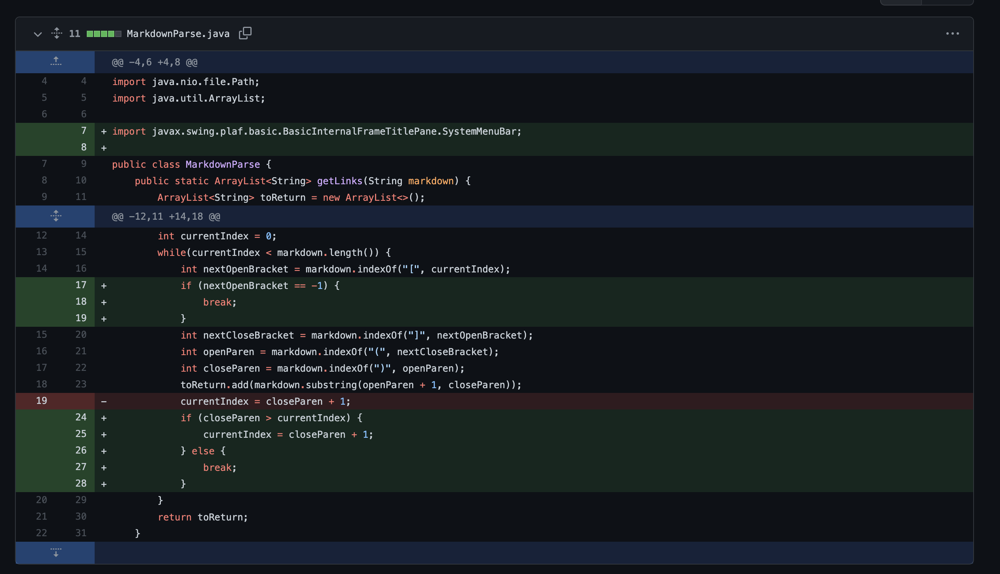
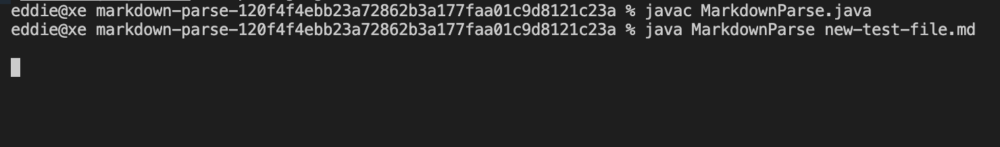
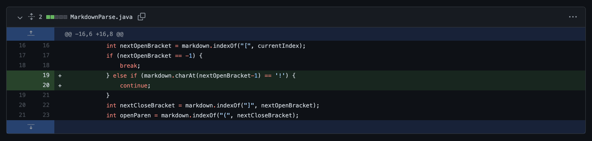
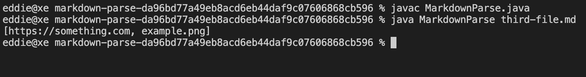
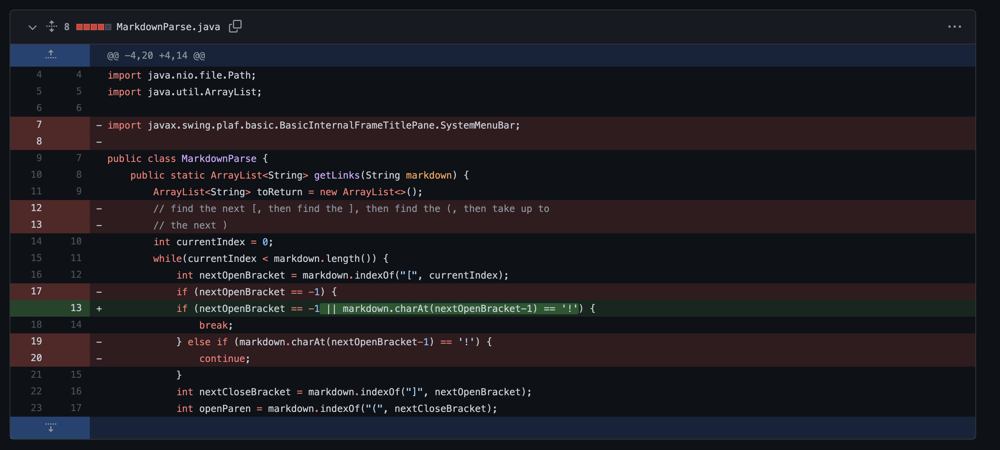
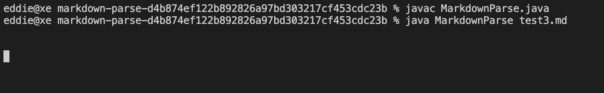

## Lab Report 2 Week 4
---
**Change 1**

Failed Test File: [Link](https://raw.githubusercontent.com/eldev314/markdown-parse/120f4f4ebb23a72862b3a177faa01c9d8121c23a/new-test-file.md)

Console Output: Essentially, the console didn't print out anything and got stuck, which suggests that the program was stuck in an infinite loop

The symptom in the output, the infinite loop, suggests that the bug is some sort of infinite loop. From the failed test file, we can deduce that it's because there is are parentheses used for a separate list, which our program expects is for a link. Since the parentheses never close, it leaves us in our infinite loop, which we fixed by adding if statements to check for that and end the program accordingly.

**Change 2**

Failed Test File: [Link](https://raw.githubusercontent.com/eldev314/markdown-parse/da96bd77a49eb8acd6eb44daf9c07606868cb596/third-file.md)

Console Output: The console is including the path of the image as part of the links when it shouldn't be.

The symptom in the output, the fact that the image path is included in the output, tells us that the bug might be that our program can't differentiate between links and images. From the test file, we can see that the format for a list and image are super similar, with the only main difference being the ! added before the Image, which out program doesn't check for. Thus, it will include all images alongside links. To fix this, we simply added a check for the ! and ignore the supposed "link" if there is one.

**Change 3**

Failed Test File: [Link](https://raw.githubusercontent.com/eldev314/markdown-parse/da96bd77a49eb8acd6eb44daf9c07606868cb596/third-file.md)

Console Output: The console is once again stuck and not printing anything, suggesting again that the program is stuck in an infinite loop.

The sympton in the output, the fact that it's stuck and not exiting, tells us that the bug is probably that the program is stuck in an infinite loop. Upon checking the file and the code, it becomes apparent that the program gets stuck because it keeps running continue when it sees an exclamation point. To fix this, we include the check for the exclamation point in the if and break when it finds it so it won't get stuck.

