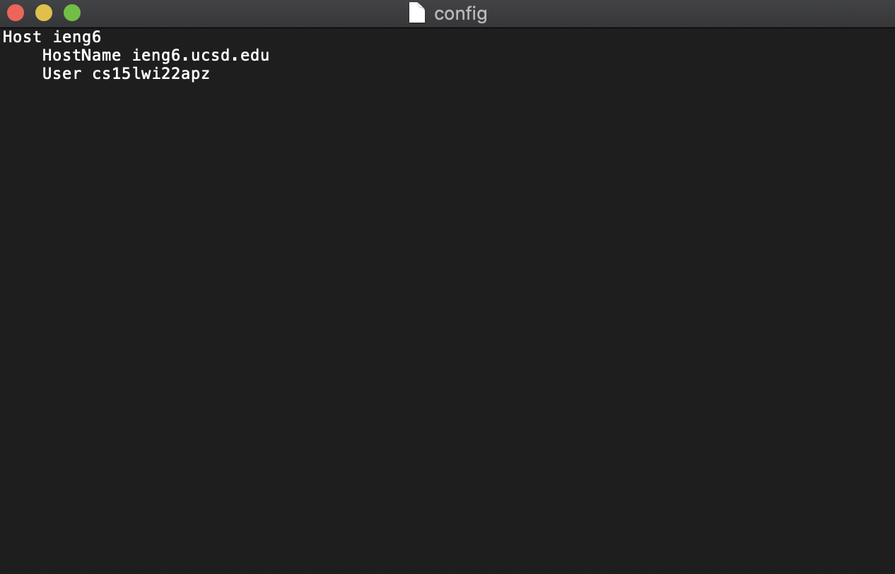
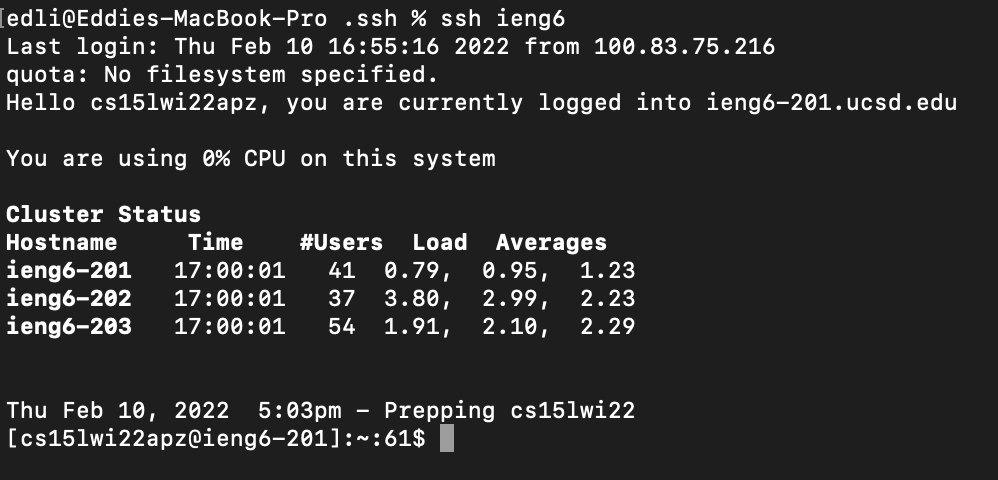
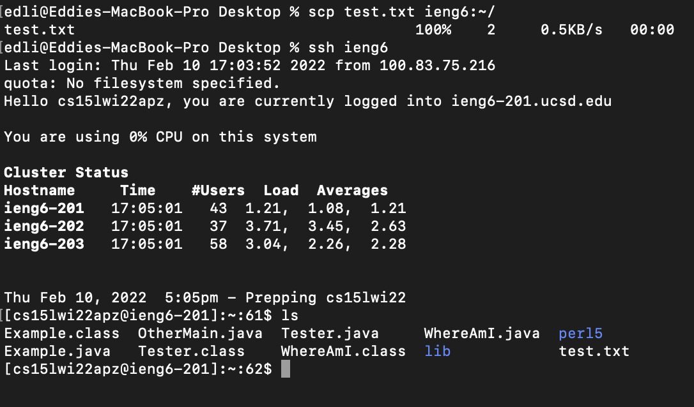

## Lab Report 3 Week 6
---
### Streamlining ssh Configuration

Run the command ```cd ~/.ssh``` in the terminal and then create the config file with ```touch config``` if it doesn't already exist. Open the file with a text editor and past in the following.

```
Host ieng6
    HostName ieng6.ucsd.edu
    User cs15lwi22zzz (use your username)
```
Here is my example of setting up the config file.



To test what we have just set up, we can ssh and scp using the shortcut we've just created. My example of using ssh and scp with this is shown below.



As you can see, I was able to connect by just running ```ssh ieng6```



Similarly, I was able to scp over a test file by just running ```scp test.txt ieng6:~/```
