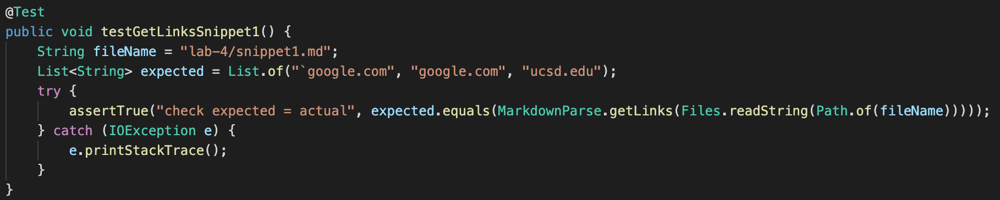
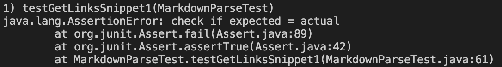
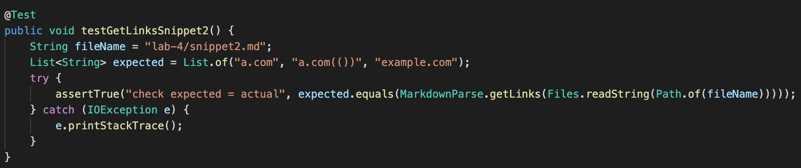
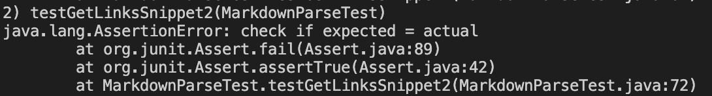
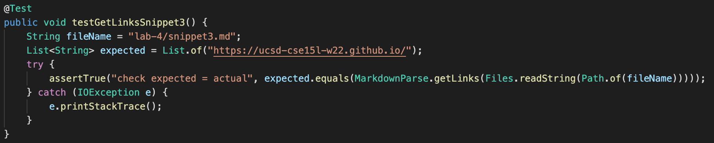
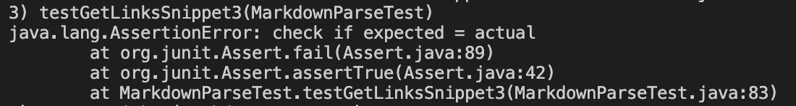

## Lab Report 4 Week 8
---

**Github Repo Links**

[My markdown-parse](https://github.com/eldev314/markdown-parse)

[Reviewed markdown-parse](https://github.com/JaredJose/markdown-parse)

### Snippet 1

**Intended Output**

Using the CommonMark demo site, I believe the intended output should be an ArrayList containing the following: "`google.com", "google.com", "ucsd.edu"

**Code to Test**

**My Implementation of MarkdownParse**

It fails the test, as shown below in the output.

**Reviewed Implementation of MarkdownParse**

It also fails the test, as shown below in the output.

<!--- I'm reusing the same image for both implementations
because the output is identical since they both fail all 3 snippets -->

### Snippet 2

**Intended Output**: Using the CommonMark demo site, I believe the intended output should be an ArrayList containing the following: "a.com", "a.com(())", "example.com"

**Code to Test**

**My Implementation of MarkdownParse**

It fails the test, as shown below in the output.

**Reviewed Implementation of MarkdownParse**

It also fails the test, as shown below in the output.

<!--- I'm reusing the same image for both implementations
because the output is identical since they both fail all 3 snippets -->

### Snippet 3

**Intended Output**: Using the CommonMark demo site, I believe the intended output should be an ArrayList containing just one String: "https://ucsd-cse15l-w22.github.io/"

**Code to Test**

**My Implementation of MarkdownParse**

It fails the test, as shown below in the output.

**Reviewed Implementation of MarkdownParse**

It also fails the test, as shown below in the output.

<!--- I'm reusing the same image for both implementations
because the output is identical since they both fail all 3 snippets -->

### Code Changes

**Snippet 1**: I don't think a small code change of less than 10 lines will make it work for these cases because you need to check specifically if the brackets or parentheses are included as part of inline code while still allowing it when just the inside of said brackets and parentheses include inline code. I don't think it'll be super simple because you can't just check if there is a ` before and after because they might be part of separate inline code blocks.

**Snippet 2**: I also don't think a small code change of less than 10 lines will make it work for these cases because there a lot of cases you have to consider that will probably take more than 10 lines. For example, you have to check for nested links (which will presumably check for internal brackets), but then you also have to check if those brackets are escaped. Then you also have to check and account for extra parentheses. All in all, that's probably going to be more than 10 lines of code.

**Snippet 3**: I think a small code change of less than 10 lines might make it work for these cases because theoretically, checking if there are more than 1 consective new lines between the brackets or parentheses in the md file might be enough. That should be a simple statement or for loop which will probably be less than 10 lines.

