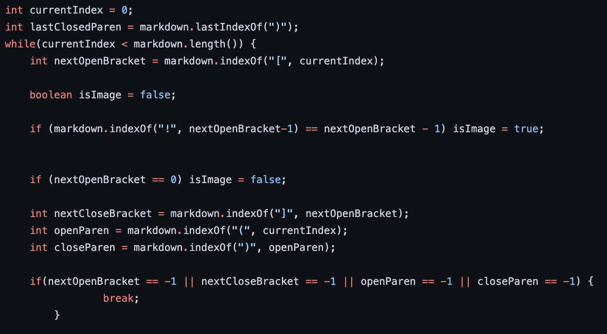

## Lab Report 5 Week 10
---

**Finding Different Results**

To find different outputs, I simply used `diff` on the resuls.txt file for the two different implementations. A section of the output of the `diff` command is pictured below.

**Difference Test 12**

The difference on line 47 corresponds to test 12, which is the following md file:

My implementation returns [\\] while the other implementation returns [], which is the correct answer. The reason my implementation returns [\\] is because it doesn't properly check that there are corresponding parentheses for the brackets. My program notes that there is a set of open and closed parenthes so it assumes it's valid but that set is actually before the brackets. I did include a check, but it searches for open parentheses after the current index and not the index of the brackets. To fix this, I should either change the starting index to search for open parentheses to nextCloseBracket or add a separate check for directly after the bracket.

**Difference Test 194**

The difference on line 211 corresponds to test 194, which is the following md file:

My implementation returns [], which is correct, and the other implementation returns [url]. There is no link but the reason the other implementation returns url is because there is a set of brackets and a set of parentheses with url inside coming after the brackets. To fix this, the other implementation needs to check that the parentheses is right after the valid close bracket instead of just checking if there is a parentheses anywhere after the closed bracket.

